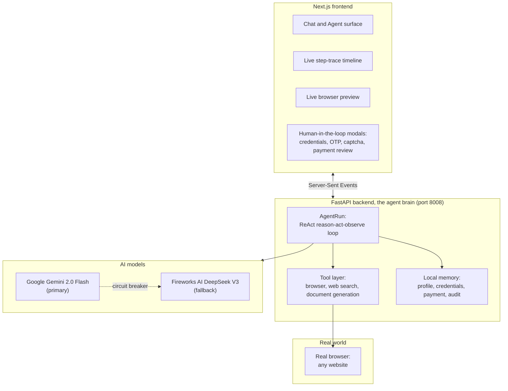
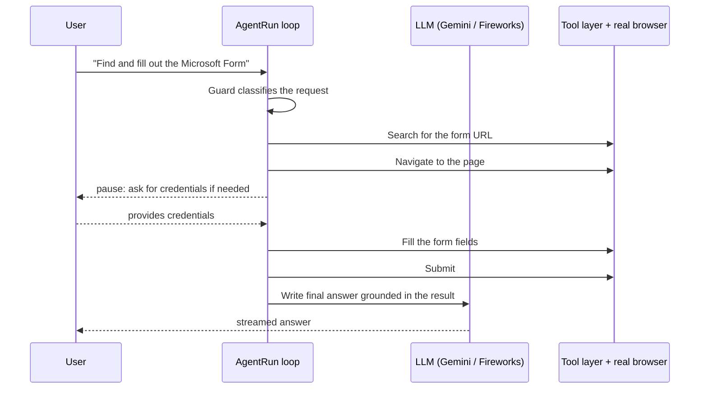

# Clark — General-purpose Autonomous Web Agent

Clark is a general-purpose autonomous web agent. It takes a goal in natural language, opens a real browser, and works through it step by step — navigating pages, filling forms, searching the web, and reporting back — pausing for your approval at every sensitive step.

> "Not a chatbot. An agent that actually does things."

---

## Table of contents

1. [What Clark does](#1-what-clark-does)
2. [Try it: example tasks](#2-try-it-example-tasks)
3. [Solution architecture](#3-solution-architecture)
4. [Agentic workflow design](#4-agentic-workflow-design)
5. [How the LLM powers Clark](#5-how-the-llm-powers-clark)
6. [Key features](#6-key-features)
7. [External tools and technologies](#7-external-tools-and-technologies)
8. [Project structure](#8-project-structure)
9. [Getting started](#9-getting-started)
   - 9.5 [Project documents](#95-project-documents)
10. [Privacy and safety](#10-privacy-and-safety)
11. [Honest limitations and roadmap](#11-honest-limitations-and-roadmap)

---

## 1. What Clark does

One agent handles a wide range of browser-based tasks. It decides per request whether to search the web, navigate to a specific site, fill forms, or extract information — all autonomously.

- **Browser automation.** Opens a real browser, navigates any website, clicks buttons, fills text fields, selects dropdowns, handles dialogs — just like a person would.
- **Web search.** Uses DuckDuckGo (no API key needed) to find information, then visits the relevant pages.
- **Form filling.** Identifies form fields and fills them from your saved profile or asks you for what it needs.
- **Human-in-the-loop gates.** Pauses for credentials, OTP codes, captchas, and payment review. Your secrets stay on your machine.
- **Multi-step tasks.** Can chain many steps — search → navigate → log in → fill → submit → read result → report back.
- **Document generation.** Writes markdown documents (reports, summaries, formatted output) and saves them as artefacts.
- **Live preview.** Shows you the browser in real time so you can watch what the agent is doing.

---

## 2. Try it: example tasks

These are real prompts the agent is built to handle:

```
Find the cheapest flight from New York to London next month
Fill out a Microsoft Form with my details
Search for the latest news about AI regulation
Register for an account on a service
Research product specifications and summarize them
Check the current exchange rate between USD and EUR
```

The agent decides on its own whether each request is a quick search, a multi-page research task, or a full browser-automation sequence.

---

## 3. Solution architecture

Clark is a two-process stack with Google Gemini at its core and Fireworks AI as a fallback.



**1. Backend (the agent brain), FastAPI on port 8008.**
A streaming API (`/api/*`) that runs the agentic loop and emits every step as Server-Sent Events. Key endpoints: `/api/agent` (the agentic loop), `/api/agent/resume`, `/api/agent/credentials`, `/api/agent/inputs`, `/api/agent/captcha`, `/api/agent/otp` (the human-in-the-loop continuations), `/api/chat` (plain streaming chat), plus profile, payment, credentials, history, and workspace endpoints.

**2. Frontend, Next.js 14 (App Router) on port 3000.**
A single-page app with two modes: Chat (multi-turn Q&A) and Agent (one autonomous task per conversation). It renders the streamed trace, a live preview of the browser, a Profile drawer (saved info, payment card, saved logins), a History panel that replays past runs step by step, and purpose-built human-in-the-loop modals. The design system is dependency-light: a custom inline SVG icon set, a custom Markdown renderer (no `dangerouslySetInnerHTML`, so no XSS surface), and CSS animations.

---

## 4. Agentic workflow design

### 4.1 A ReAct loop with a JSON tool protocol

The agent uses a ReAct-style JSON protocol. On every turn the model must reply with exactly one JSON object, either a tool call or a final answer:

```json
{ "thought": "I need to search for the page first",
  "action": "web_search",
  "action_input": { "query": "cheap flights New York to London June 2026" } }
```

The loop parses that object (tolerating code fences and surrounding prose through brace-matching), runs the real tool, feeds the observation back, and repeats.



### 4.2 Mental model: think, act, observe

The agent keeps a compact history of what it has done so far and decides the next action one step at a time. It is limited to 16 steps per task to prevent runaway loops.

### 4.3 Human-in-the-loop by design

The agent never acts blindly on anything sensitive. It pauses and hands control back to you, then resumes from exactly where it left off:

- **Sign-in.** You enter your username and password into a masked form. The credentials go only to the local backend to fill the login form; they are never sent to the AI model.
- **One-time codes (2FA) and captchas.** The agent does not try to solve these. It surfaces the challenge to you, you provide the code, and it continues.
- **Payments.** Before any payment, the agent shows a review screen and waits for your explicit approval.
- **Mid-task information.** If the agent encounters a form field it cannot fill from your saved profile, it asks you for the value.

If you cancel, the agent stops cleanly and tells you nothing was submitted.

### 4.4 Memory and state

- **Profile ("My Info").** Identity fields (name, email, address, etc.) that the agent reuses to auto-fill forms, so it only asks for what it genuinely lacks. You can populate it by uploading a photo of an ID card: the Gemini vision model reads the card and fills the fields for your review.
- **Saved logins.** A local, password-manager-style store keyed by site, so the agent can sign you back in to a portal you have used before. Secrets are stored locally and never sent to the model.
- **Saved payment card.** Local only, used to fill fee forms, never sent to the model.
- **Audit trail.** Every conversation is persisted as a full, timestamped transcript, replayable from the History panel.

### 4.5 Grounded answers

For any task that involves reading a page, the final answer is re-derived from a fresh read of the live result page, with a strict instruction to use only the facts present on that page and never outside knowledge. This keeps the agent truthful about actual results.

---

## 5. How the LLM powers Clark

| Capability | Model | Where it is used |
|---|---|---|
| Conversational answers and final responses | Google Gemini 2.0 Flash | Chat mode; the agent's streamed final answer; knowledge-based answers |
| Planning and tool selection | Google Gemini 2.0 Flash | The ReAct loop's step-by-step decisions |
| Vision and image understanding | Google Gemini 2.0 Flash (multimodal) | Reading ID card photos, interpreting screenshots, OCR |
| Safety and guard | Google Gemini 2.0 Flash as a classifier | Vetting every user request before the agent acts |
| Fallback when primary is unavailable | Fireworks AI DeepSeek V3 | Every Gemini capability — automatic circuit-breaker fallback |

### Resilience design

Because AI model APIs can slow down or go offline independently, the LLM client has:

- **Per-provider circuit breaker.** If Gemini returns repeated errors, the client marks it down for a configurable TTL (default 180s) and transparently falls back to Fireworks AI.
- **Fast-fail timeouts.** A short timeout (default 75s for agent steps, 15s for fast chat) prevents a slow endpoint from hanging the agent.
- **Per-task context trimming.** The agent automatically trims old messages when the context window gets full, keeping the most recent steps and oldest system instructions.

---

## 6. Key features

- **Live browser preview.** Watch the agent navigate in real time.
- **Numbered overlay system (Set-of-Marks).** Draws numbered boxes over every interactive element on the page so the agent can click or fill by number — no brittle XPath or CSS selectors.
- **Step-by-step trace.** A timeline of every thought, action, and observation, with the option to expand any step for details.
- **Chat mode.** A simple multi-turn chat interface that does not use the browser — just Q&A.
- **Artefacts.** Generated documents are saved and displayed in the sidebar.
- **Profile with ID-card scanning.** Upload a photo of your ID and the agent reads it to fill your profile automatically.
- **Saved credentials.** A local password-manager-like store so the agent can log you into sites automatically.
- **Dark theme.** Full dark-mode UI with a warm gold accent palette.
- **Single-user, local-first.** Everything runs on your machine. No accounts, no telemetry, no cloud dependencies beyond the AI API.

---

## 7. External tools and technologies

- **Google Gemini API** — primary AI model (httpx REST API). Used for chat, planning (ReAct loop), vision (ID card OCR, screenshot understanding), and request safety classification.
- **Fireworks AI API** — fallback AI model (DeepSeek V3 via OpenAI-compatible httpx endpoint). Automatic circuit-breaker failover when Gemini is unavailable.
- **Playwright** — drives a real, visible Chromium browser. Handles navigation, click, fill, scroll, and screenshot capture.
- **FastAPI + Uvicorn** — serve the streaming SSE agent API on port 8008.
- **Next.js 14, React 18, TypeScript, Tailwind CSS** — build the frontend (port 3000).
- **DuckDuckGo web search** — lightweight search via HTML-scrape endpoint (no API key needed).
- **httpx** — HTTP client for all AI API calls, timeouts, and circuit-breaker logic.
- **@paper-design/shaders-react** — WebGL mesh-gradient background shader.
- **three / @react-three/fiber** — 3D rendering engine and React binding (used by the mesh shader).

Everything the agent stores (profile, saved logins, payment card, audit transcripts) is plain local JSON under an `agent_workspace/` directory. No external database, no telemetry. All storage is thread-safe via `threading.Lock`.

---

## 8. Project structure

```
Clark V2/
├── backend/                        FastAPI agent brain (Python)
│   ├── main.py                     API endpoints (SSE streaming)
│   ├── agent.py                    AgentRun: the ReAct loop
│   ├── llm_client.py               LLM client (Gemini primary + Fireworks fallback)
│   ├── tools.py                    Tool registry + dispatcher (~20 tools)
│   ├── browser_session.py          Playwright browser + numbered-overlay grounding
│   ├── profile_store.py            "My Info" profile + ID-photo vision auto-fill
│   ├── credentials_store.py        Local, host-keyed saved logins (thread-safe)
│   ├── payment_store.py            Local saved payment card (thread-safe)
│   ├── audit.py                    Full transcript / history persistence
│   ├── Dockerfile                  Docker image (Playwright Python base)
│   ├── .dockerignore
│   ├── requirements.txt
│   └── .venv/                      Python virtual environment
├── frontend/                       Next.js 14 UI (TypeScript)
│   ├── app/
│   │   ├── layout.tsx              Root layout (MeshBackground, fonts, overlays)
│   │   ├── page.tsx                SPA: Chat + Agent modes, all panels
│   │   └── globals.css             Full design system (Midnight Tuxedo palette)
│   ├── Dockerfile                  Docker image (multi-stage Node.js)
│   ├── .dockerignore
│   ├── next.config.js              Next.js config (API rewrites)
│   └── components/
│       ├── ClarkMark.tsx           Brand logo + wordmark
│       ├── LivePreview.tsx         Browser frame + human-in-the-loop gates
│       ├── StepTimeline.tsx        Numbered agent trace
│       ├── TraceDisclosure.tsx     Collapsible trace wrapper
│       ├── ProfilePanel.tsx        My Info + Payment + Credentials drawer
│       ├── HistoryPanel.tsx        Conversation list + replay
│       ├── Markdown.tsx            Safe React-based Markdown (no dangerouslySetInnerHTML)
│       ├── Icon.tsx                Inline SVG icon set (no dependency)
│       ├── Marquee.tsx             Infinite scrolling capability ticker
│       └── ui/
│           └── MeshBackground.tsx  WebGL animated mesh gradient
├── scripts/                        Cross-platform run scripts (.bat, .ps1, .sh)
│   ├── start-backend.bat           Backend launcher (batch — uses .venv activate)
│   ├── start-frontend.bat          Frontend launcher (batch)
│   ├── start-desktop.bat           Desktop shell (removed — placeholder notice)
│   ├── run_backend.ps1             Backend launcher (PowerShell)
│   ├── run_frontend.ps1            Frontend launcher (PowerShell)
│   ├── run_desktop.ps1             Both services launcher (PowerShell)
│   └── run_backend.sh              Backend launcher (macOS / Linux)
├── skyvern/                        Legacy Skyvern artifacts (retired)
│   ├── har/                        HTTP Archive logs (historical)
│   ├── log/                        Execution logs (historical)
│   └── temp/                       Temp browser profiles (historical)
├── docs/
│   └── superpowers/specs/          Migration and design specs
├── docker-compose.yml              Docker Compose orchestration (backend + frontend)
├── START.bat                       One-click Windows launcher
└── README.md                       This file
```

---

## 9. Getting started

### Prerequisites

- Python 3.12 to 3.14 (for local development)
- Node.js and npm (for local development)
- Google Chrome (for the browser surface)
- A Google Gemini API key (get one at https://aistudio.google.com/)
- (Optional) A Fireworks AI API key for fallback (get one at https://fireworks.ai/)
- Docker and Docker Compose (for the Docker workflow — optional, but recommended)

### Configure your API keys

```bash
cd backend
cp .env.example .env      # on Windows: copy .env.example .env
```

Open `backend/.env` and set at minimum:

```
GEMINI_API_KEY=your_gemini_api_key_here
```

Optional overrides:

```
GEMINI_MODEL=gemini-2.0-flash
FIREWORKS_API_KEY=your_fireworks_api_key
FIREWORKS_MODEL=accounts/fireworks/models/deepseek-v3
```

### Run it with Docker (recommended)

Build and start both services with a single command:

```bash
docker compose up --build
```

- Backend: http://localhost:8008
- Frontend: http://localhost:3000

The backend runs Chromium headlessly inside the container. Profile data, credentials, and audit history persist in a Docker volume (`agent_workspace`).

To stop: `docker compose down`

To reset stored data: `docker compose down -v`

### Run it locally (two processes)

**Backend** (port 8008):

```bash
cd backend
python -m venv .venv
.venv\Scripts\activate          # Windows
# source .venv/bin/activate     # macOS / Linux
python -m pip install --upgrade pip
pip install -r requirements.txt
python -m playwright install chromium
python -m uvicorn main:app --reload --port 8008
```

**Frontend** (port 3000):

```bash
cd frontend
npm install
npm run dev
```

Open http://localhost:3000.

### One-click launcher (Windows)

Double-click `START.bat` in the project root. On first run it creates `backend/.env` and opens it so you can paste your `GEMINI_API_KEY`; save it and run `START.bat` again to start everything.

---

### 9.5 Project documents

Key reference documents live in the project root:

| Document | What it covers |
|---|---|
| [`docker-compose.yml`](docker-compose.yml) | Docker Compose orchestration for running both services in containers |
| [`START.bat`](START.bat) | One-click Windows launcher (local development) |

---

## 10. Privacy and safety

- **Secrets stay local and never reach the model.** Passwords and full payment-card data are stored only in local JSON on your machine and are injected by the backend to fill forms. They are never sent to the AI and never written to the audit log.
- **The model never sees your one-time codes or captchas.** OTP, captcha, and verification codes are handled outside the model entirely.
- **You approve anything irreversible.** Sign-in, codes, and payments all pause for your explicit confirmation.
- **A safety guard runs first.** Every request is vetted by an AI-based classifier before any action is taken.
- **A transparent audit trail.** Every step the agent took is recorded and replayable.
- **No injection surface in the UI.** The Markdown renderer builds React nodes directly rather than injecting HTML.

This is a single-user, runs-on-your-own-device assistant by design.  
**Important:** Credentials (passwords) and payment card data are stored in *plaintext* JSON files under `agent_workspace/`. The agent is designed to run on a personal, local machine — do not expose the backend port (8008) to a network you do not trust.

---

## 11. Honest limitations and roadmap

- **The agent is only as reliable as the AI model it uses.** Tool-calling accuracy, context-window limits, and latency vary by model and provider.
- **Complex multi-step flows can fail mid-way.** A site redesign or unexpected popup can throw the agent off. It handles many common patterns but is not invulnerable.
- **The agent works best on structured web pages.** Heavy JavaScript single-page apps and sites with aggressive anti-bot measures may cause issues.
- **It is a single-user, local-device assistant.** Not built as a shared multi-tenant service.
- **16-step cap per task.** Designed for focused, single-goal autonomous tasks.

### Roadmap

- Add support for more complex multi-page workflows
- Expand the human-in-the-loop toolkit (file downloads, multi-factor auth beyond OTP)
- Support additional LLM providers (Claude, local models via Ollama)
- Add structured evaluation benchmarks

---

Built with Google Gemini and Fireworks AI.
