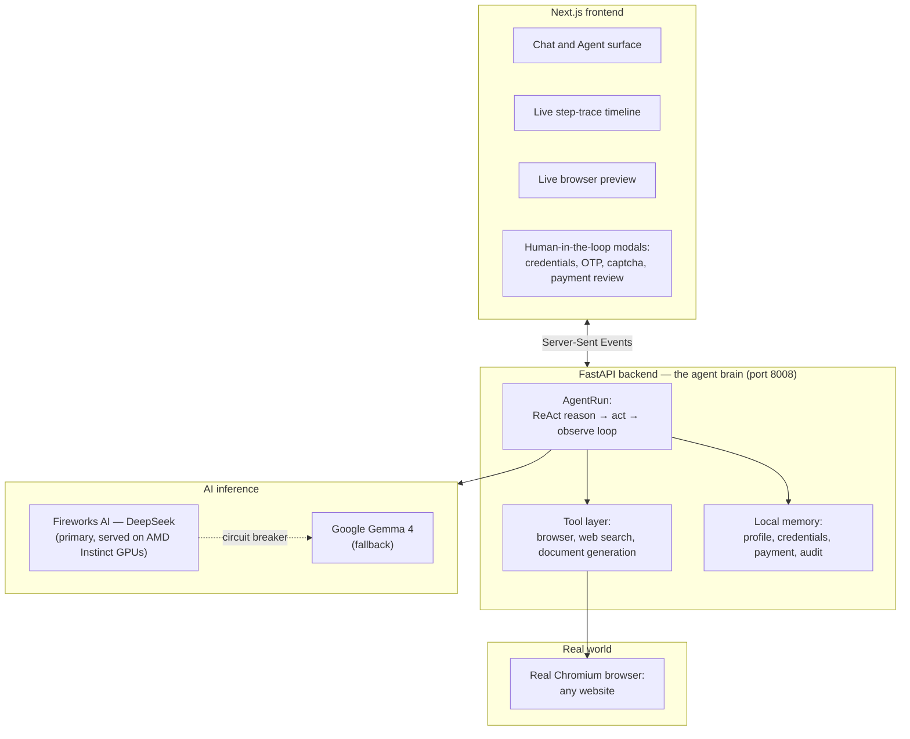
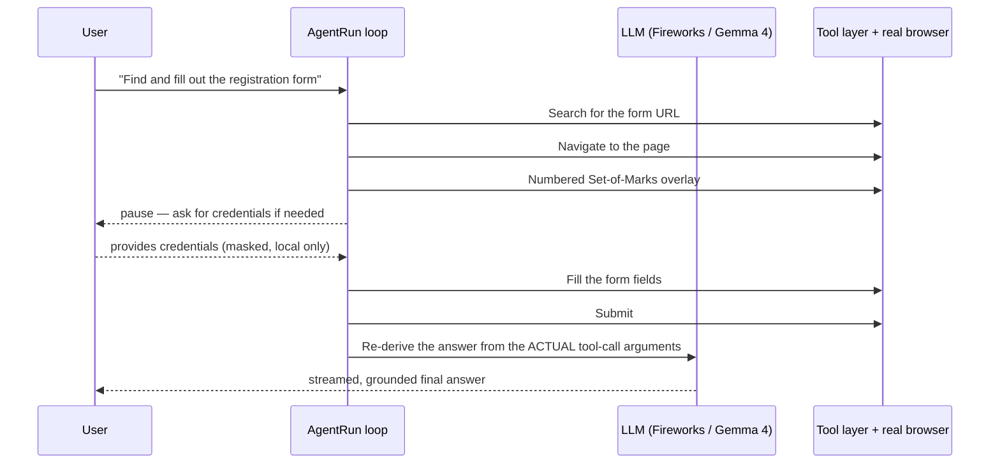

# Clark — General-Purpose Autonomous Web Agent

**Not a chatbot. An agent that actually does things.**

[](#technology-stack)
[](#technology-stack)
[](#technology-stack)
[](#technology-stack)
[](#running-with-docker)
[](#amd-technologies-used)
[](#license)

Built for the **AMD Developer Hackathon — ACT II (Unicorn Track)**.

## Table of Contents

- [Overview](#overview)
- [The Problem](#the-problem)
- [Our Solution](#our-solution)
- [Key Features](#key-features)
- [Why It Matters](#why-it-matters)
- [Demo](#demo)
- [System Architecture](#system-architecture)
- [AI Workflow](#ai-workflow)
- [Technology Stack](#technology-stack)
- [AMD Technologies Used](#amd-technologies-used)
- [Repository Structure](#repository-structure)
- [Getting Started](#getting-started)
- [Usage Guide](#usage-guide)
- [Example Workflow](#example-workflow)
- [API Documentation](#api-documentation-if-applicable)
- [Project Highlights](#project-highlights)
- [Challenges We Solved](#challenges-we-solved)
- [Design Decisions](#design-decisions)
- [Security & Privacy](#security--privacy)
- [Performance & Scalability](#performance--scalability)
- [Future Roadmap](#future-roadmap)
- [Business & Market Potential](#business--market-potential)
- [Team](#team)
- [Contributing](#contributing-optional)
- [License](#license)
- [Acknowledgements](#acknowledgements)
- [Contact](#contact)

---

## Overview

Clark is a general-purpose autonomous web agent. Give it a goal in plain language and it opens a real browser, reasons about what to do next one step at a time, and works through the task — navigating pages, filling forms, searching the web, signing in, and reporting back — pausing for your explicit approval at every sensitive step (logins, one-time codes, CAPTCHAs, payments).

It is not a hard-coded macro recorder and not a chatbot that only *talks about* the web. It decides, per request, whether to search, navigate, click, type, or ask you for something it's missing — the same way a person would sit down and just do the task.

---

## The Problem

**Problem statement.** A large share of "web work" is mechanical: filling in the same kind of form on a different site, searching for and comparing information across several pages, logging into a portal to check a status, or extracting a few facts and writing them up. None of it is intellectually hard, but all of it costs time and attention, and it doesn't get easier just because AI chat exists — a chatbot can *describe* how to renew a form, but it can't open the page and do it.

**Who is affected.** Anyone with a goal that lives on the web rather than in their own head: students and researchers pulling information from many pages, professionals filing recurring paperwork, people navigating bureaucratic or government e-service portals that are dense, multi-step, and unforgiving of mistakes, and generally anyone who is comfortable chatting with an AI but not necessarily comfortable (or interested) in wrangling a ten-step web form.

**Why it matters.** Every manual, repetitive browser session is time not spent on the actual task the person cares about. Worse, brittle multi-page government/enterprise workflows create real friction to access — a wrong field, a missed step, or an unfamiliar UI pattern can mean starting over.

**Current pain points.**
- Constant context-switching between "what I want" and "which button gets me there."
- Forms and portals with inconsistent, unfamiliar, or poorly labelled UI.
- Logins, OTPs, and CAPTCHAs that block naive automation and require a human anyway.
- No memory across sites — the same identity information gets typed in again and again.
- No record of what was actually done, so mistakes are hard to catch or undo.

---

## Our Solution

Clark turns "I have to go fill this out" into "Clark, handle this." It combines a real, visible browser (Playwright/Chromium) with an LLM-driven reasoning loop (ReAct-style: think → act → observe → repeat) so it can operate **any** website, not just ones it was specifically programmed for.

**Core value proposition:** a single, general-purpose agent — not a library of per-site scripts — that can search, click, type, log in, and extract data, while treating anything sensitive (credentials, one-time codes, CAPTCHAs, payments) as a hard stop that hands control back to a human.

**Why it's different:**
- **No hard-coded task registry.** Clark doesn't ship with a fixed list of "supported sites." It reasons about whatever page is in front of it.
- **Numbered, grounded clicking.** A Set-of-Marks overlay numbers every interactive element on the page, so the agent clicks/fills "box #14" instead of relying on brittle CSS/XPath selectors that break the moment a site redesigns.
- **Human-in-the-loop by design**, not as an afterthought — the agent is architecturally unable to type a password, OTP, or full card number itself.
- **Grounded final answers.** Before answering, Clark re-derives its summary from the actual arguments of the tool calls it made — not from what the model *thinks* it did — which closes a real hallucination gap ("I filled in 'cake'" when it actually typed "pizza").
- **Resilient by construction.** Two independent LLM providers with a per-provider circuit breaker mean a single provider outage degrades gracefully instead of stopping the agent.

---

## Key Features

- **Real browser automation.** Opens a visible (or headless) Chromium session, navigates, clicks, fills text fields, selects dropdowns, and handles dialogs like a person would.
- **General-purpose web search.** Finds information and the right page to act on, with no per-domain configuration.
- **Adaptive form filling.** Identifies form fields — including split date pickers, dropdown-based date fields, and free-text fields matched by meaning — and fills them from a saved profile or asks for exactly what's missing.
- **Human-in-the-loop gates.** Dedicated, masked flows for credentials, OTP codes, CAPTCHAs, and payment review; nothing sensitive is ever sent to the model.
- **Multi-step task chaining.** Search → navigate → log in → fill → submit → read the result → report back, all in one run, up to a configurable step budget.
- **Document generation.** Writes and saves Markdown reports, summaries, and formatted letters as real files in the workspace.
- **Live preview + full trace.** Watch the agent's browser in real time, and expand any step to see exactly what it thought, did, and observed.
- **Saved "My Info," credentials, and payment card.** Local, password-manager-style stores so the agent only ever asks for what it doesn't already have — including populating identity fields straight from a photographed ID card via vision.
- **Full audit trail.** Every conversation is persisted as a replayable, timestamped transcript.
- **Anti-bot resilient browsing.** Stealth-aware Playwright session (hides common headless tells, optional persistent Chrome profile, optional real-Chrome CDP attach) so the agent behaves like a normal, returning browser rather than a disposable automation session.

---

## Why It Matters

Clark's value isn't a novelty demo — it's time and access. Every task it completes end-to-end is a task a person didn't have to manually click through, and every human-in-the-loop gate means that speed doesn't come at the cost of safety: the person still approves the login, the OTP, and the payment. For services that are dense or intimidating to navigate, an agent that can read the page, ask for exactly the missing piece of information, and act on the answer lowers the bar to actually getting things done — without asking anyone to trust an AI with their password.

---

## Demo

- **Demo Video:** [Watch on YouTube](https://youtube.com)
- **Presentation Slides:** [`clark-hackathon-deck.html`](./clark-hackathon-deck.html) — a self-contained, single-file slide deck (open directly in any browser; arrow keys / on-screen controls to navigate; prints cleanly to PDF).

---

## System Architecture

Clark is a two-process stack with a real browser at the edge and a dual-provider LLM core.



**Backend (the agent brain), FastAPI on port 8008.** A streaming API (`/api/*`) that runs the agentic loop and emits every step as Server-Sent Events. Key endpoints: `/api/agent` (the agentic loop), `/api/agent/resume`, `/api/agent/credentials`, `/api/agent/inputs`, `/api/agent/captcha`, `/api/agent/otp` (human-in-the-loop continuations), `/api/chat` (plain streaming chat), plus profile, payment, credentials, history, and workspace endpoints.

**Frontend, Next.js 14 (App Router) on port 3000.** A single-page app with two modes — Chat (multi-turn Q&A) and Agent (one autonomous task per conversation) — rendering the streamed trace, a live preview of the browser, a "My Info" drawer, a History panel that replays past runs step by step, and purpose-built human-in-the-loop modals.

**Browser layer.** Each agent session owns a dedicated worker thread holding a Playwright browser instance for its whole life (Playwright's sync API is thread-bound, and the browser must survive across several HTTP requests while a human logs in or solves an OTP).

---

## AI Workflow

### A ReAct loop with a JSON tool protocol

On every turn, the model replies with exactly one JSON object — a tool call or a final answer:

```json
{ "thought": "I need to search for the page first",
  "action": "web_search",
  "action_input": { "query": "cheap flights New York to London June 2026" } }
```

The loop parses that object (tolerating stray text and code fences via brace-matching), runs the real tool, feeds the observation back, and repeats — up to a configurable step budget, with a forced "wrap up now" instruction near the limit so a task never ends in silence.



### Mental model: think, act, observe

The agent keeps a compact history of what it has done and decides the next action one step at a time, trimming older context automatically so long tasks don't blow the model's context window.

### Human-in-the-loop by design

- **Sign-in.** Credentials are typed into a masked form that goes only to the local backend to fill the login page — never to the AI model.
- **One-time codes (2FA) and CAPTCHAs.** The agent never tries to solve these; it surfaces the challenge, you provide the answer, and it continues.
- **Payments.** Before any payment, the agent shows a review screen (amount, recipient details) and waits for explicit approval.
- **Mid-task information.** If a form needs a field the agent can't find in the saved profile, it asks — once — and can optionally remember it for next time.

### Grounded answers

For final answers, Clark re-derives its summary from the *actual* tool-call arguments recorded during the run rather than from the model's own account of what it did — closing a common agent failure mode where the narrated result quietly drifts from what was actually typed or clicked.

---

## Technology Stack

### Frontend
- **Next.js 14** (App Router) + **React 18** + **TypeScript**
- **Tailwind CSS** with a fully custom design system (see [`DESIGN.md`](./DESIGN.md))
- Server-Sent Events client for live streaming of the agent's trace
- Dependency-light: a hand-built Markdown renderer (no `dangerouslySetInnerHTML`) and inline SVG icon set
- `@paper-design/shaders-react` for the animated WebGL mesh-gradient background

### Backend
- **Python 3.12–3.14**, **FastAPI** + **Uvicorn** (SSE streaming API on port 8008)
- **Playwright** driving a real Chromium browser: navigation, click, fill, scroll, screenshot, Set-of-Marks annotation
- **httpx** for all outbound HTTP/AI API calls, with per-call timeouts and circuit-breaker logic
- `python-dotenv`, `pydantic`, `defusedxml` (safe XML parsing for the arXiv tool)

### AI & Machine Learning
- **Fireworks AI** — primary inference provider (DeepSeek-class chat model + a vision model for OCR/screenshot understanding), served on **AMD Instinct GPUs**
- **Google Gemma 4** — fallback inference provider (chat + multimodal vision), engaged automatically if Fireworks is unreachable
- Custom **ReAct** agent loop with a JSON tool-call protocol, brace-matching JSON extraction, and a step-budgeted planner
- Vision-based ID-card OCR pipeline (transcribe → structure) for auto-filling the saved profile

### Databases
- No external database. All persistent state — profile, saved credentials, saved payment card, and the full audit trail — is thread-safe, local JSON under `agent_workspace/`.

### Infrastructure
- Per-session Playwright worker threads (one real browser per active agent session)
- Persistent Chrome profile support + optional CDP attach to a user's already-running Chrome, for anti-bot resilience on real-world portals
- Per-provider circuit breaker with a configurable down-TTL and fast-fail timeouts on the LLM client

### Deployment
- **Docker Compose** — two services (`backend`, `frontend`), a healthcheck-gated startup, and a named volume for `agent_workspace`
- Backend image based on the official Playwright Python image (Chromium + system deps pre-installed)
- Frontend image is a multi-stage Next.js standalone build served by a minimal Node.js runtime

---

## AMD Technologies Used

### AMD Services

Clark's **primary** inference path — every reasoning step, tool-selection decision, and vision/OCR call that goes through Fireworks AI — runs on **AMD Instinct™ GPUs** (MI300X / MI325X / MI355X class accelerators) via Fireworks' AMD-optimized inference stack (FireAttention) and the open **ROCm™** software ecosystem, under Fireworks' multi-year AMD partnership. Google Gemma 4 serves as the automatic fallback provider if the primary path is ever unavailable.

> _If the deployed environment also runs the FastAPI backend or browser workers on AMD EPYC™-based compute, add those details here — the architecture is agnostic to CPU vendor, so this is a deployment choice rather than a code dependency._

### Why AMD

- **High-memory accelerators** (up to 192 GB+ HBM per GPU on the MI300-class line) let Fireworks serve large, DeepSeek-class models with the headroom needed for Clark's longer agentic contexts, without the aggressive truncation that would otherwise hurt reasoning quality.
- **ROCm's open software stack** avoids single-vendor lock-in for the inference layer Clark depends on for every step of its loop.
- **Cost/throughput efficiency** at the inference layer keeps the per-step latency of Clark's ReAct loop low enough for a genuinely live, streamed step trace rather than a slow batch job.

### Performance Benefits

Per Fireworks' own published benchmarks, their AMD-specific inference implementation (FireAttention V3) measured on AMD Instinct MI300 GPUs delivers up to **1.4×–1.8× throughput improvements** over comparable inference implementations on other accelerators for Llama-class models — the same optimized serving path that carries Clark's primary chat and vision calls. _(These are Fireworks/AMD's published benchmark figures for their inference stack, not independent measurements Clark's team ran itself — replace with your own numbers if you benchmark Clark's own step latency end-to-end.)_

---

## Repository Structure

```
Clark/
├── backend/                        FastAPI agent brain (Python)
│   ├── main.py                     API endpoints (SSE streaming)
│   ├── agent.py                    AgentRun: the ReAct loop
│   ├── llm_client.py               LLM client (Fireworks primary + Gemma 4 fallback)
│   ├── tools.py                    Tool registry + dispatcher (~20 tools)
│   ├── browser_session.py          Playwright browser + Set-of-Marks grounding
│   ├── profile_store.py            "My Info" profile + ID-photo vision auto-fill
│   ├── credentials_store.py        Local, host-keyed saved logins (thread-safe)
│   ├── payment_store.py            Local saved payment card (thread-safe)
│   ├── audit.py                    Full transcript / history persistence
│   ├── eval_smoke.py               Live smoke test against the real LLM + browser
│   ├── Dockerfile
│   ├── requirements.txt
│   └── .env.example
├── frontend/                       Next.js 14 UI (TypeScript)
│   ├── app/                        Root layout, page, global design-system CSS
│   ├── components/                 Chat/Agent UI, live preview, trace timeline,
│   │                                profile/history panels, Markdown renderer, icons
│   ├── Dockerfile
│   └── next.config.js
├── docs/superpowers/specs/          Migration and redesign design docs
├── docker-compose.yml               Orchestrates backend + frontend
├── DESIGN.md                        Full design system (palette, type, components)
├── PRODUCT.md                       Product brief, audience, brand personality
├── START.bat                        One-click Windows launcher
├── RUN.md                           Detailed run instructions
└── README.md                        This file
```

---

## Getting Started

### Prerequisites
- Python 3.12–3.14
- Node.js and npm
- Google Chrome (used as the automated browser surface)
- A **Fireworks AI** API key (primary inference — get one at https://fireworks.ai/)
- A **Google AI** API key (fallback — get one at https://aistudio.google.com/)
- Docker and Docker Compose (optional, recommended for the one-command path)

### Installation

```bash
git clone https://github.com/your-org/clark.git
cd Clark
cd backend && cp .env.example .env && cd ..
```

### Environment Variables

Set these in `backend/.env` (see `backend/.env.example` for the full list):

| Variable | Required | Default | Purpose |
|---|---|---|---|
| `FIREWORKS_API_KEY` | Recommended (primary) | — | Primary LLM provider, served on AMD Instinct GPUs |
| `GEMINI_API_KEY` | Recommended (fallback) | — | Fallback LLM provider |
| `FIREWORKS_MODEL` | No | `accounts/fireworks/models/deepseek-v4-pro` | Chat model override |
| `GEMINI_MODEL` | No | `gemma-4-26b-a4b-it` | Fallback chat/vision model override |
| `LLM_TIMEOUT` / `LLM_FAST_TIMEOUT` | No | `75` / `15` (s) | Per-call timeouts |
| `LLM_DOWN_TTL` | No | `180` (s) | How long a failed provider is skipped |
| `BROWSER_HEADLESS` | No | `false` (local) / `true` (Docker) | Show or hide the automated browser window |
| `BROWSER_PERSISTENT` | No | `true` | Reuse a saved Chrome profile across runs |
| `BROWSER_CDP_AUTODETECT` | No | `true` | Auto-attach to a debuggable Chrome on `:9222` |

### Running the Project

**Backend:**
```bash
cd backend
python -m venv .venv && source .venv/bin/activate   # Windows: .venv\Scripts\activate
pip install --upgrade pip && pip install -r requirements.txt
python -m playwright install chromium
python -m uvicorn main:app --reload --port 8008
```

**Frontend** (separate terminal):
```bash
cd frontend
npm install
npm run dev
```

Open http://localhost:3000.

### Running with Docker

```bash
docker compose up --build
```
- Frontend: http://localhost:3000
- Backend: http://localhost:8008
- Stop: `docker compose down` · Reset stored data: `docker compose down -v`

### Deploying to the Cloud (free)

Clark can run in the cloud on free tiers for demo / judging purposes.

**Architecture:**
```
Vercel (free)                            Render (free)
┌──────────────────────┐     API calls    ┌─────────────────────────┐
│  Next.js Frontend    │ ──────────────── │  Docker Web Service     │
│  (auto-deployed)     │   CORS direct    │  │ FastAPI              │
│                      │                  │  │ Playwright + Chrome  │
│  NEXT_PUBLIC_BACKEND │                  │  │ Chromium (headless)  │
│  _URL = Render URL   │                  │  └───────────────────── │
└──────────────────────┘                  └─────────────────────────┘
```

**1. Deploy the Backend (Render — free)**

1. Push this repo to GitHub.
2. Go to [Render Dashboard](https://dashboard.render.com) → **New +** → **Blueprint**.
3. Connect your GitHub repo. Render detects `render.yaml` and pre-fills the config.
4. Set the secret env vars in the Render dashboard:
   - `FIREWORKS_API_KEY` (required — primary LLM)
   - `GEMINI_API_KEY` (optional — fallback)
5. Click **Apply**. Render builds the Docker image and deploys.
6. Copy your backend URL (e.g. `https://clark-backend.onrender.com`).

> **Free tier note:** Render spins down after 15 min idle. First request after idle takes ~30-60 s (cold start). For always-on, upgrade to Starter ($7/mo).

**2. Deploy the Frontend (Vercel — free)**

1. Go to [Vercel Dashboard](https://vercel.com/new) → Import the same GitHub repo.
2. Vercel auto-detects Next.js — no config needed.
3. Add environment variable:
   - `NEXT_PUBLIC_BACKEND_URL` = `https://clark-backend.onrender.com` (your Render URL)
4. Deploy. Your frontend is live at a `*.vercel.app` URL.

**3. Verify**

- Open the Vercel URL. The UI loads in seconds.
- Try an agent action. The first API call wakes the backend (30-60 s cold start).
- The backend health endpoint: `https://clark-backend.onrender.com/api/health`

---

## Usage Guide

1. Open the app and choose **Agent** mode for a task you want done end-to-end, or **Chat** mode for a plain Q&A conversation.
2. Type your goal in plain language (e.g. "check the current USD/EUR exchange rate" or "log into \<site\> with my saved credentials and download my latest invoice").
3. Watch the live trace: each thought, tool call, and observation streams in as it happens, alongside a live view of the browser.
4. When the agent needs you — a login, an OTP, a CAPTCHA, or a payment to approve — it pauses and shows a dedicated, masked form. Nothing sensitive is ever sent to the model.
5. Review the final, grounded answer and download any generated documents from the conversation.
6. Open **History** any time to replay a past run step by step, or **My Info** to manage your saved profile, credentials, and payment card.

---

## Example Workflow

> "Log into the-internet.herokuapp.com/login with username `tomsmith` and password `SuperSecretPassword!`, then confirm I'm signed in."

1. `web_search` / `open_page` → Clark opens the login page.
2. `see_page` → numbers every interactive element (Set-of-Marks overlay).
3. The page has a login form → Clark surfaces a **masked credentials** prompt (the model never sees the values).
4. You submit credentials → Clark's backend fills and submits the form directly, then re-reads the page.
5. Clark confirms success from the actual post-login page state (not from memory) and streams a grounded final answer.

---

## API Documentation (if applicable)

All endpoints are served by the FastAPI backend on port `8008` (proxied to `/api/*` by the frontend).

| Method | Endpoint | Purpose |
|---|---|---|
| `GET` | `/api/health` | Service status + configured LLM provider |
| `GET` | `/api/capabilities` | Chat/vision model identifiers |
| `POST` | `/api/chat` | Plain streaming chat (SSE) |
| `POST` | `/api/agent` | Start/continue the agentic loop (SSE) |
| `POST` | `/api/agent/resume` | Continue after a human approval/pause |
| `POST` | `/api/agent/credentials` | Provide masked login credentials |
| `POST` | `/api/agent/inputs` | Provide a missing form value mid-task |
| `POST` | `/api/agent/captcha` | Submit a CAPTCHA solution |
| `POST` | `/api/agent/otp` | Submit a one-time code |
| `POST` | `/api/agent/stop` | Cancel a running task |
| `GET` | `/api/history` / `/api/history/{id}` | List/replay past conversations |
| `GET`/`PUT` | `/api/profile` | Read/save the "My Info" profile |
| `POST` | `/api/profile/extract` | Extract profile fields from an uploaded ID photo |
| `GET`/`PUT` | `/api/payment` | Read/save the saved payment card |
| `GET`/`PUT`/`DELETE` | `/api/credentials` / `/api/credentials/{host}` | Manage saved logins |
| `GET` | `/api/screenshot/{name}` | A PNG frame the agent captured |
| `GET` | `/api/agent/screen/{session_id}` | Live browser frame for the in-app preview |
| `GET` | `/api/workspace` / `/api/workspace/download/{name}` | List/download generated artefacts |

---

## Project Highlights

- **General-purpose by construction** — no fixed, hard-coded list of supported sites or task types.
- **~20-tool** dispatcher covering search, navigation, Set-of-Marks interaction, smart date/text filling, login, and document generation.
- **Live, step-by-step transparency** — every thought, action, and observation is streamed and replayable, not hidden behind a spinner.
- **Safety-first human-in-the-loop** for anything irreversible or sensitive.
- **Dual-provider resilience** with an automatic circuit breaker, so a single AI provider outage degrades gracefully.

---

## Challenges We Solved

- **Grounding clicks without brittle selectors.** Real-world sites constantly change their DOM. The Set-of-Marks numbered-overlay approach lets the agent act on *what it can currently see*, rather than a CSS/XPath selector that a redesign can silently break.
- **Telling "blocked" apart from "empty."** Bot walls, CAPTCHAs, paywalls, and JS-only shells all *look* like an empty page to a naive scraper. Clark's browser layer classifies page state (`blocked`, `truncated`, `page_error`, `has_login`) so the agent can react correctly instead of confidently reporting nothing found.
- **Keeping the agent honest about what it actually did.** LLMs narrating their own actions can drift from reality. The grounded-final-answer step re-derives the summary from the recorded tool-call arguments instead of the model's memory of them.
- **Surviving anti-bot defenses without ever seeing a password.** Persistent Chrome profiles, stealth patches for common headless tells, and human-like typing/mouse movement improve pass rates on real portals — while credentials, OTPs, and card data are still only ever handled outside the model.
- **Fitting long tasks into a limited context window.** Automatic message compaction and a hard step budget (with a forced "wrap up" instruction near the limit) keep long multi-step tasks from silently running out of room or looping forever.

---

## Design Decisions

- **A dedicated worker thread per browser session.** Playwright's synchronous API is thread-bound, and a session's browser must survive across several separate HTTP requests while a human completes a login or OTP — so each `BrowserSession` owns one long-lived thread that receives operations as queued closures.
- **JSON-only, one-object-per-turn protocol** for the agent loop, parsed with a brace-matching fallback so stray prose or code fences around the JSON don't break the loop.
- **Two independent LLM providers with a circuit breaker**, rather than a single point of failure, with fast-fail timeouts so a slow provider can't stall the whole agent.
- **Local-first state.** Profile, credentials, payment card, and audit history are plain JSON on disk — no external database, no telemetry, no cloud dependency beyond the AI API itself.
- **Human-in-the-loop is structural, not a policy.** The tool layer has no code path that lets the model type a password, OTP, or full card number — those values are injected directly by the backend after the human provides them.

---

## Security & Privacy

- **Secrets stay local and never reach the model.** Passwords and full payment-card data are stored only in local JSON on your machine and injected by the backend to fill forms — never sent to the AI and never written to the audit log.
- **The model never sees one-time codes or CAPTCHAs.** Those are handled entirely outside the model.
- **You approve anything irreversible** — sign-in, one-time codes, and payments all pause for explicit confirmation before proceeding.
- **A transparent, replayable audit trail** for every conversation.
- **No HTML-injection surface in the UI** — the Markdown renderer builds React nodes directly instead of using `dangerouslySetInnerHTML`.
- **Important:** credentials and payment data are currently stored as **plaintext** JSON under `agent_workspace/`. Clark is designed to run on a personal, trusted machine — do not expose the backend port to an untrusted network. Hardening this (stronger at-rest protection, comprehensive PII redaction across the whole audit trail, and outbound SSRF domain-blocking on every execution path) is an active item on the roadmap.

---

## Performance & Scalability

- **Per-session isolation.** Each active agent session gets its own browser worker thread, so sessions don't block one another.
- **Fast-fail timeouts + circuit breaker** on the LLM client mean a struggling provider is skipped for a cooldown window instead of stalling every request behind it.
- **Automatic context compaction** trims older messages once a task's running context grows past a size threshold, keeping later steps fast even in long tasks.
- **Stateless API layer.** The FastAPI backend can be scaled horizontally behind a load balancer; the browser workers are the only per-session, stateful component.
- **Docker Compose today, container-orchestrator-ready tomorrow** — the two-service split (backend/frontend) with a healthcheck-gated startup is a straightforward lift into Kubernetes or a managed container platform for multi-user scale.

---

## Future Roadmap

### Short-term Goals
- Finish the general-purpose redesign: remove the fixed task registry in favor of a fully dynamic, LLM-driven intent step.
- Unify the CLI and web execution pipelines (today they've drifted independently) behind one execution path.
- Comprehensive, non-short-circuiting PII redaction across the entire audit trail.
- Outbound SSRF domain-blocking on every execution path, not just some.
- Universal CAPTCHA detection with a clean, structured failure report instead of a silent stall.
- Expand the action vocabulary (native `<select>`, checkboxes, radios) with an adaptive, LLM-assisted fallback loop for unusual controls.
- A Docker-based smoke test as part of the release checklist.

### Long-term Vision
- Support for more complex, multi-page workflows and a larger step budget for the adaptive click-planner loop.
- Expand the human-in-the-loop toolkit beyond OTP to other common MFA methods.
- Support additional LLM providers (e.g. Claude, local models via Ollama), and evaluate a self-hosted ROCm-based inference tier alongside the managed Fireworks path.
- Structured evaluation benchmarks for reliability across a broad set of real-world sites.
- Team/enterprise features: shared credential vaults with access controls, admin oversight, and compliance-ready audit exports.
- A companion mobile experience for reviewing and approving human-in-the-loop gates on the go.

---

## Business & Market Potential

**Target users.** General consumers with tedious, recurring web chores; students and researchers; professionals who file recurring paperwork; and, longer-term, teams and organizations with high-volume, form-heavy workflows (procurement, citizen services, back-office operations).

**Market opportunity.** Browser/task automation is shifting from brittle, per-site RPA scripts toward general-purpose, LLM-driven agents — a category growing alongside the broader adoption curve of agentic AI. Clark's general-purpose, no-hard-coded-registry design targets the exact gap that legacy RPA and narrow browser-copilot tools leave open: acting correctly on a site it has never seen before.

**Revenue model.**
- **Freemium, local-first** core product (what this repository is) for individual users.
- **Hosted/Pro tier** for people who don't want to run their own backend — more concurrent sessions, higher step budgets, priority inference.
- **Usage-based API** for developers who want to embed Clark's agent loop in their own product.
- **Enterprise tier** — shared credential vaults, admin controls, SSO, and compliance-ready audit exports for teams automating internal or citizen-facing workflows.

**Scalability.** The stateless FastAPI core and per-session browser workers scale horizontally; the local-first architecture keeps baseline infrastructure cost low per user, with LLM inference cost passed through directly — and the AMD Instinct-backed Fireworks inference path gives real headroom on cost/throughput as usage grows.

---

## Team

### Members

| Name | Role | Links |
|---|---|---|
| &nbsp; | &nbsp; | &nbsp; |

### Roles
_Add team member details and describe how the work was split._

---

## Contributing (optional)

This project was built for the AMD Developer Hackathon ACT II (Unicorn Track). Issues and pull requests are welcome once the repository is public — please open an issue describing the change before submitting a large PR. If you spot something specific to the agent's browser tooling (a site pattern it mishandles, a selector edge case), including a minimal reproduction really helps.

---

## License

This project is distributed under the [MIT License](LICENSE) — see the `LICENSE` file at the repository root for the full text. If you fork or adapt this project for your own submission, please retain appropriate attribution.

---

## Acknowledgements

- **AMD** — for the Instinct GPU platform and ROCm software ecosystem powering the primary inference path via Fireworks AI, and for hosting the Developer Hackathon ACT II (Unicorn Track).
- **Fireworks AI** and **Google Gemma 4** — the two LLM providers behind Clark's reasoning loop and vision calls.
- **Playwright** — the real-browser automation engine at the core of every action Clark takes.
- The open-source projects this build stands on: FastAPI, Next.js, React, Tailwind CSS, and everything listed in [Technology Stack](#technology-stack).

---

## Contact

This project was built for the **AMD Developer Hackathon — ACT II (Unicorn Track)**. For questions or collaboration, please open an issue on the repository.
